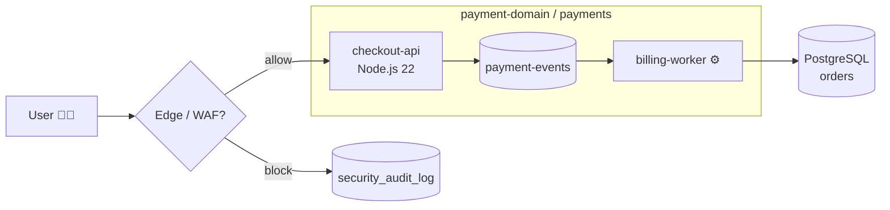

# Checkout Architecture

This diagram intentionally includes emoji, special punctuation, and nested subgraphs.

```mermaid
flowchart LR
  user["User 🧑‍💻"] --> edge{"Edge / WAF?"}
  edge -->|allow| api["checkout-api\nNode.js 22"]
  edge -->|block| audit[(security_audit_log)]
  subgraph cluster_payments["payment-domain / payments"]
    api --> queue[(payment-events)]
    queue --> worker["billing-worker ⚙️"]
  end
  worker --> db[(PostgreSQL\norders)]
```
