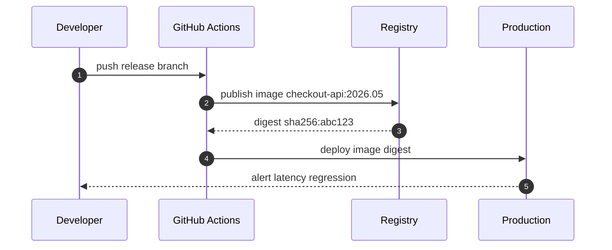

# Incident Flow

```mermaid
sequenceDiagram
  autonumber
  participant Dev as Developer
  participant CI as GitHub Actions
  participant Reg as Registry
  participant Prod as Production
  Dev->>CI: push release branch
  CI->>Reg: publish image checkout-api:2026.05
  Reg-->>CI: digest sha256:abc123
  CI->>Prod: deploy image digest
  Prod-->>Dev: alert latency regression
```
